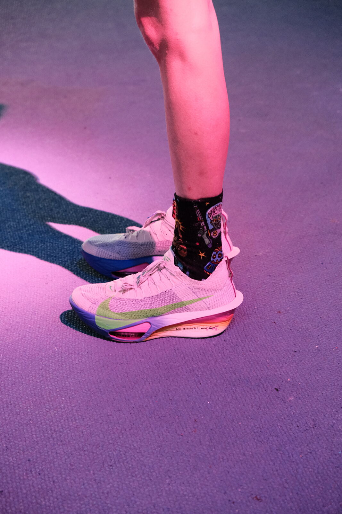
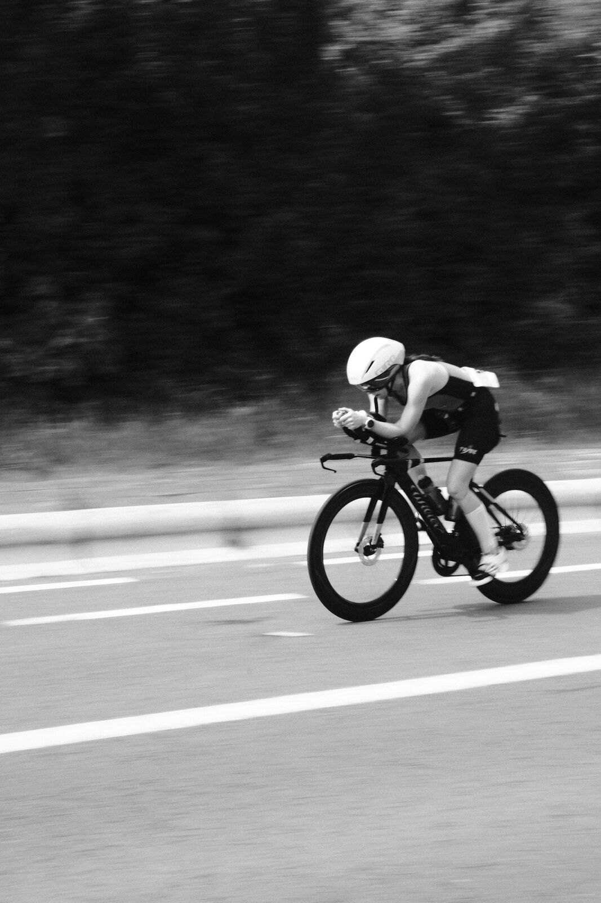
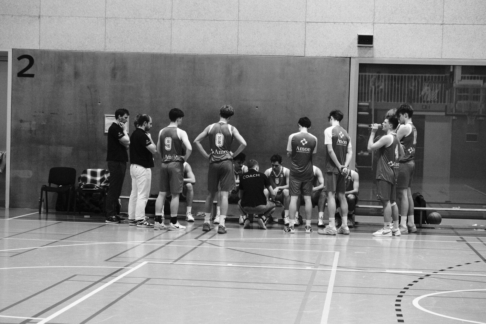
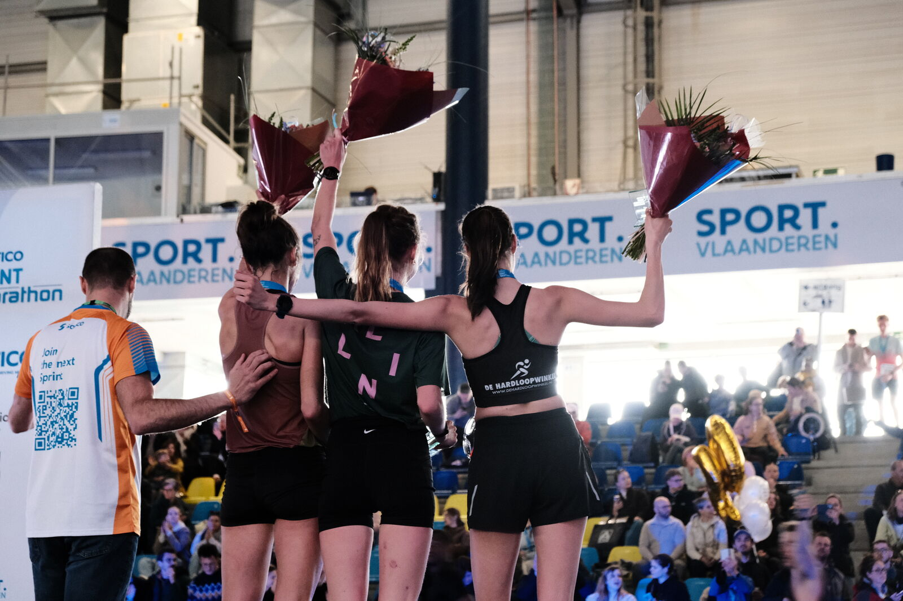
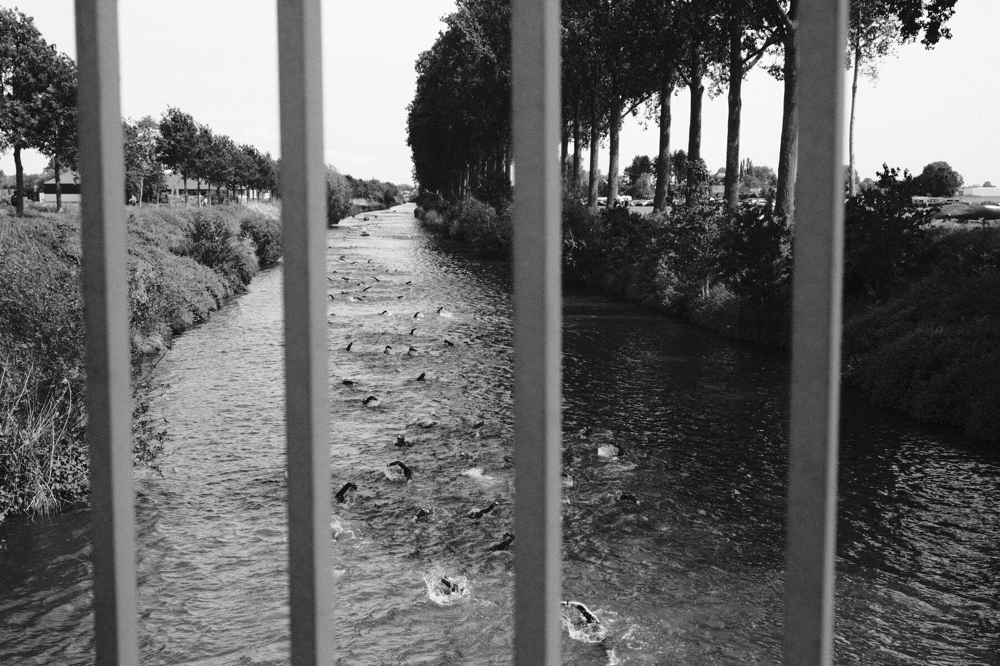

```{=html}
<main>

<!-- ===== PAGE HEAD ===== -->
<section class="page-head">
  <div class="page-head-inner">
    <p class="kicker">Aanbod</p>
    <h1 class="d-title">Het aanbod</h1>
    <p class="lede">
      Geen standaardtrajecten. We vertrekken vanaf jouw startlijn
      en bouwen van daaruit, stap voor stap.
    </p>
  </div>
</section>

<!-- ===== OFFER ROWS ===== -->
<section class="section">
  <div class="section-inner">

    <div class="offer-row rv">
      <div class="lane-num" aria-hidden="true">01</div>
      <div>
        <h3>Individuele begeleiding voor sporters</h3>
        <p>Eén-op-één werken aan wat jou tegenhoudt of net vooruit kan duwen. Voor jeugdtalent, amateurs met ambitie en elitesporters.</p>
        <ul>
          <li>Wedstrijdspanning en faalangst</li>
          <li>Blessure, revalidatie en de comeback</li>
          <li>Overtraining, herstel en balans</li>
          <li>Perfectionisme en zelfvertrouwen</li>
          <li>Identiteit naast de sport</li>
        </ul>
      </div>
      <figure class="photo-frame" style="margin:0">
        
        <figcaption class="photo-caption"><span>Sneller word je niet alleen met je benen.</span></figcaption>
      </figure>
    </div>

    <div class="offer-row alt rv">
      <figure class="photo-frame" style="margin:0">
        
        <figcaption class="photo-caption"><span>Een doctoraat is een tijdrit.</span></figcaption>
      </figure>
      <div class="lane-num" aria-hidden="true">02</div>
      <div>
        <h3>Studenten &amp; doctorandi</h3>
        <p>Presteren in een omgeving die nooit pauze lijkt te nemen. Kortdurend en oplossingsgericht waar het kan, dieper waar het moet.</p>
        <ul>
          <li>Prestatiedruk, examens en deadlines</li>
          <li>Uitstelgedrag en planning</li>
          <li>Perfectionisme en twijfel</li>
          <li>Presenteren, publiceren en verdedigen</li>
          <li>Balans tussen onderzoek en leven</li>
        </ul>
      </div>
    </div>

    <div class="offer-row rv">
      <div class="lane-num" aria-hidden="true">03</div>
      <div>
        <h3>Teams &amp; clubs</h3>
        <p>Een team is meer dan de som van zijn spelers. Samen werken aan hoe jullie communiceren, omgaan met druk en elkaar beter maken.</p>
        <ul>
          <li>Teamdynamiek en communicatie</li>
          <li>Omgaan met druk als groep</li>
          <li>Ondersteuning en sparring voor coaches</li>
          <li>Mentale vaardigheden trainen op het veld</li>
        </ul>
      </div>
      <figure class="photo-frame" style="margin:0">
        
        <figcaption class="photo-caption"><span>De time-out is soms het belangrijkste moment van de match.</span></figcaption>
      </figure>
    </div>

    <div class="offer-row alt rv">
      <figure class="photo-frame" style="margin:0">
        
        <figcaption class="photo-caption"><span>Kennis deel je het best hardop.</span></figcaption>
      </figure>
      <div class="lane-num" aria-hidden="true">04</div>
      <div>
        <h3>Lezingen &amp; workshops</h3>
        <p>Interactieve sessies op maat van jouw club, federatie, school, universiteit of organisatie.</p>
        <ul>
          <li>Omgaan met druk en faalangst</li>
          <li>Motivatie en doelen stellen</li>
          <li>Herstel, slaap en belastbaarheid</li>
          <li>Mentaal welzijn in en naast de sport</li>
        </ul>
      </div>
    </div>

  </div>
</section>

<!-- ===== VERLOOP ===== -->
<section class="section" style="background: var(--paper-deep); border-block: 1px solid var(--line);">
  <div class="section-head rv">
    <p class="kicker">Praktisch verloop</p>
    <h2 class="d-title">Zo verloopt het</h2>
  </div>
  <div class="section-inner">
    <div class="steps">
      <div class="step rv">
        <div class="step-num" aria-hidden="true">01</div>
        <h3>Kennismaking</h3>
        <p>Een eerste gesprek, zonder verplichtingen. We bekijken wat er speelt en of het klikt. Dat laatste is geen detail.</p>
      </div>
      <div class="step rv rv-1">
        <div class="step-num" aria-hidden="true">02</div>
        <h3>Plan</h3>
        <p>Samen leggen we doelen vast en kiezen we een aanpak die bij jou past. Concreet en haalbaar, geen vage beloftes.</p>
      </div>
      <div class="step rv rv-2">
        <div class="step-num" aria-hidden="true">03</div>
        <h3>Aan de slag</h3>
        <p>Sessies in de praktijk, online of in beweging. We evalueren onderweg en sturen bij waar nodig.</p>
      </div>
    </div>
  </div>
</section>

<!-- ===== QUOTE BAND ===== -->
<section class="band">
  
  <blockquote class="rv">
    Soms moet je eerst tegen de stroom in.
    <cite>Emma Boone</cite>
  </blockquote>
</section>

<!-- ===== CTA ===== -->
<section class="start-band">
  <p class="kicker rv">Eerste stap</p>
  <h2 class="start-title rv rv-1">Waar ligt jouw <em>startlijn?</em></h2>
  <a class="btn rv rv-2" href="contact.html">Plan een kennismaking</a>
</section>

</main>
```
