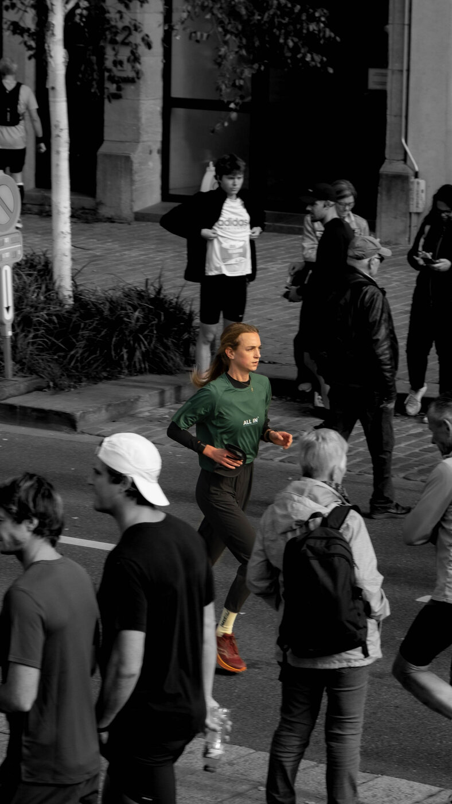
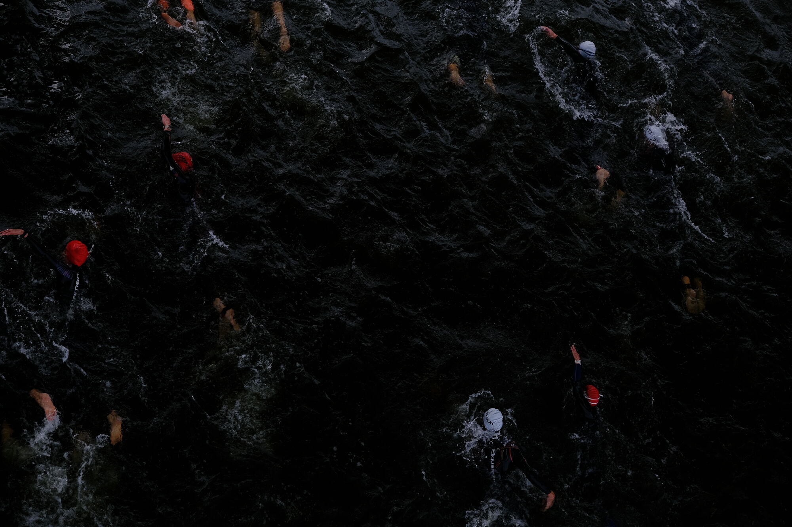
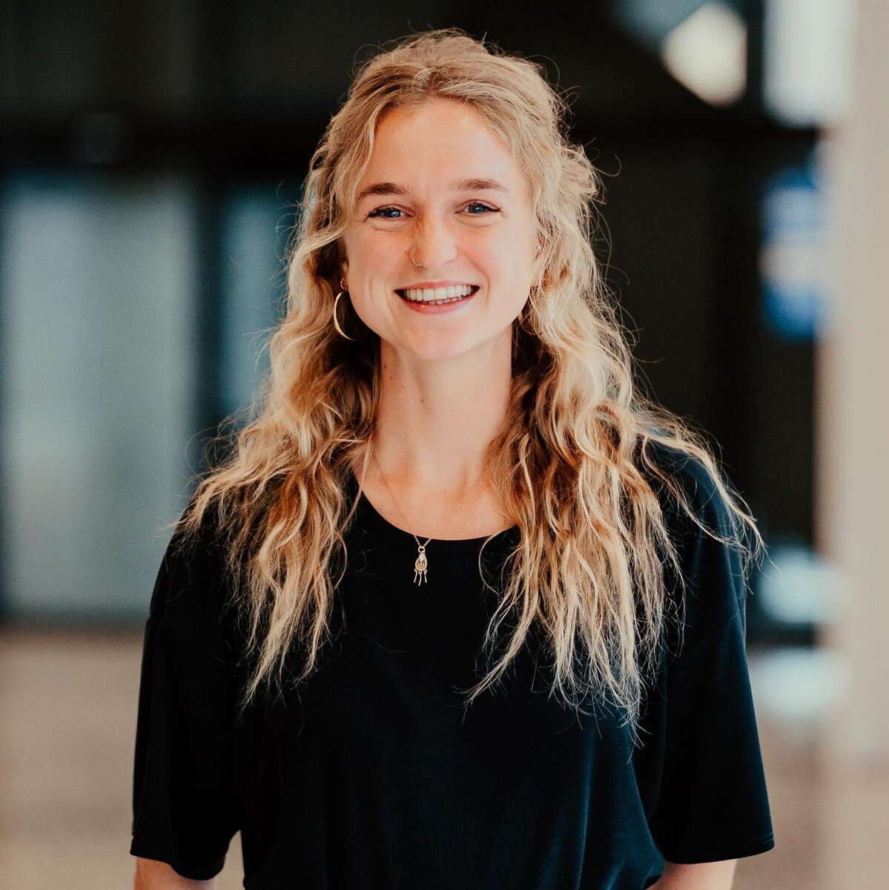

```{=html}
<main>

<!-- ===== HERO ===== -->
<section class="hero">
  <div class="hero-grid">
    <div class="hero-copy">
      <div class="hero-bib" role="presentation">
        <div class="hero-bib-top"><span><span class="dot">●</span> Gent, BE</span><span>NR. 01</span></div>
        <div class="hero-bib-name">Emma Boone</div>
      </div>
      <h1 class="hero-title">
        <span class="line"><span>Sport <em class="amp">&amp;</em></span></span>
        <span class="line"><span>Performance</span></span>
        <span class="line line-serif"><span>psycholoog</span></span>
      </h1>
      <p class="hero-lede">
        Voor sporters, studenten en doctorandi die willen presteren op de momenten
        die ertoe doen, zonder eraan onderdoor te gaan.
      </p>
      <div class="hero-actions">
        <a class="btn" href="contact.html">Maak een afspraak</a>
        <a class="btn btn-ghost" href="aanbod.html">Bekijk het aanbod</a>
      </div>
      <p class="hero-meta">Praktijk in Gent <span class="sep">·</span> ook online <span class="sep">·</span> NL / EN</p>
    </div>

    <div class="hero-photo">
      <figure class="photo-frame" style="margin:0">
        
        <figcaption class="photo-caption">
          <span>In koers is alles grijs, behalve waar je focus zit.</span>
          <span class="tag">ALL IN</span>
        </figcaption>
      </figure>
    </div>
  </div>
  <div class="hero-scroll" aria-hidden="true">scroll</div>
</section>

<!-- ===== TICKER ===== -->
<div class="ticker" aria-hidden="true">
  <div class="ticker-track">
    <div class="ticker-group">
      <span>Focus</span><span>Omgaan met druk</span><span>Zelfvertrouwen</span><span>Veerkracht</span><span>Motivatie</span><span>Herstel</span><span>Flow</span><span>Teamdynamiek</span>
    </div>
    <div class="ticker-group">
      <span>Focus</span><span>Omgaan met druk</span><span>Zelfvertrouwen</span><span>Veerkracht</span><span>Motivatie</span><span>Herstel</span><span>Flow</span><span>Teamdynamiek</span>
    </div>
  </div>
</div>

<!-- ===== VOOR WIE ===== -->
<section class="section">
  <div class="section-head rv">
    <p class="kicker">Voor wie</p>
    <h2 class="d-title">Elke arena telt</h2>
  </div>
  <div class="section-inner">
    <div class="lane rv">
      <div class="lane-num" aria-hidden="true">01</div>
      <div>
        <h3>Sporters</h3>
        <p>Van jeugdtalent tot elite. Wedstrijdspanning, faalangst, blessures, de comeback, of de vraag wie je bent naast je sport.</p>
      </div>
      <a class="arrow-link" href="aanbod.html">Aanbod</a>
    </div>
    <div class="lane rv rv-1">
      <div class="lane-num" aria-hidden="true">02</div>
      <div>
        <h3>Studenten &amp; doctorandi</h3>
        <p>Deadlines, examens, publicatiedruk, de verdediging. Presteren in een omgeving die nooit pauze lijkt te nemen.</p>
      </div>
      <a class="arrow-link" href="aanbod.html">Aanbod</a>
    </div>
    <div class="lane rv rv-2">
      <div class="lane-num" aria-hidden="true">03</div>
      <div>
        <h3>Iedereen onder druk</h3>
        <p>Je hoeft geen medaille na te jagen. Wie op het werk, op een podium of gewoon in het leven beter met druk wil omgaan, is even welkom.</p>
      </div>
      <a class="arrow-link" href="aanbod.html">Aanbod</a>
    </div>
  </div>
</section>

<!-- ===== QUOTE BAND ===== -->
<section class="band">
  
  <blockquote class="rv">
    Druk verdwijnt niet. Je leert er wel anders mee omgaan.
    <cite>Emma Boone</cite>
  </blockquote>
</section>

<!-- ===== AANBOD TEASER ===== -->
<section class="section">
  <div class="section-head rv">
    <p class="kicker">Aanbod</p>
    <h2 class="d-title">Waarmee ik je help</h2>
  </div>
  <div class="section-inner">
    <div class="cards">
      <a class="offer-card rv" href="aanbod.html">
        <figure></figure>
        <div class="offer-card-body">
          <span class="offer-card-num">01</span>
          <h3>Individuele begeleiding</h3>
          <p>Eén-op-één voor sporters, studenten en doctorandi. Evidence-based, met ACT en EMDR waar zinvol.</p>
          <span class="faux-link">Meer over individueel →</span>
        </div>
      </a>
      <a class="offer-card rv rv-1" href="aanbod.html">
        <figure></figure>
        <div class="offer-card-body">
          <span class="offer-card-num">02</span>
          <h3>Teams &amp; clubs</h3>
          <p>Teamdynamiek, communicatie en druk als groep leren dragen. Ook ondersteuning voor coaches.</p>
          <span class="faux-link">Meer over teams →</span>
        </div>
      </a>
      <a class="offer-card rv rv-2" href="aanbod.html">
        <figure></figure>
        <div class="offer-card-body">
          <span class="offer-card-num">03</span>
          <h3>Lezingen &amp; workshops</h3>
          <p>Voor clubs, federaties, scholen en universiteiten. Over druk, motivatie, faalangst en herstel.</p>
          <span class="faux-link">Meer over workshops →</span>
        </div>
      </a>
    </div>
    <div class="cards-cta rv">
      <a class="btn btn-ghost" href="aanbod.html">Volledig aanbod</a>
    </div>
  </div>
</section>

<!-- ===== OVER MIJ TEASER ===== -->
<section class="section" style="background: var(--paper-deep); border-block: 1px solid var(--line);">
  <div class="section-inner meet">
    <figure class="photo-frame rv" style="margin:0">
      
      <figcaption class="photo-caption">
        <span>Emma Boone, Gent</span>
        <span class="tag">UGENT</span>
      </figcaption>
    </figure>
    <div class="rv rv-1">
      <p class="kicker">Over mij</p>
      <h2 class="d-title">Psycholoog én atleet</h2>
      <p style="margin-top:1.2rem; color: var(--ink-soft); max-width: 36em;">
        Klinisch psycholoog, opgeleid in toegepaste sportpsychologie, en studentenpsycholoog
        aan de UGent. Zelf sta ik geregeld aan een startlijn, dus wedstrijdspanning ken ik
        niet alleen uit de handboeken.
      </p>
      <ul class="meet-facts">
        <li>ACT &amp; EMDR</li>
        <li>Studentenpsycholoog UGent</li>
        <li>Zelf in koers</li>
      </ul>
      <a class="arrow-link" href="over-mij.html">Lees mijn parcours</a>
    </div>
  </div>
</section>

<!-- ===== CTA ===== -->
<section class="start-band">
  <p class="kicker rv">Op uw plaatsen</p>
  <h2 class="start-title rv rv-1">Klaar voor de <em>start?</em></h2>
  <a class="btn rv rv-2" href="contact.html">Maak een afspraak</a>
</section>

</main>
```
