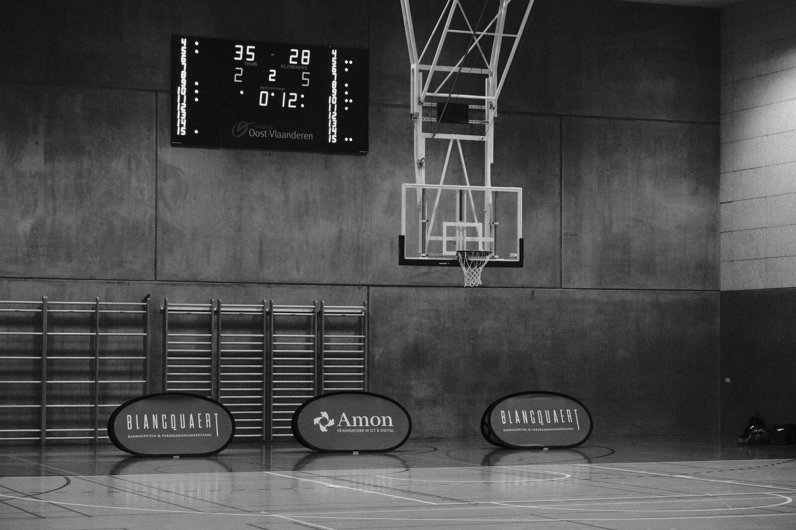

```{=html}
<main>

<!-- ===== PAGE HEAD ===== -->
<section class="page-head">
  <div class="page-head-inner">
    <p class="kicker">Over mij</p>
    <h1 class="d-title">Psycholoog én atleet</h1>
    <p class="lede">
      Ik help mensen presteren op de momenten die er voor hen toe doen.
      Niet door harder te duwen, maar door slimmer om te gaan met druk,
      mindset en herstel.
    </p>
  </div>
</section>

<!-- ===== INTRO ===== -->
<section class="section">
  <div class="section-inner meet">
    <figure class="photo-frame rv" style="margin:0">
      
      <figcaption class="photo-caption">
        <span>Emma Boone, Gent</span>
        <span class="tag">ALL IN</span>
      </figcaption>
    </figure>
    <div class="rv rv-1">
      <!-- TODO: bio nalezen en aanvullen met juiste details -->
      <p>
        Ik ben Emma Boone, klinisch psycholoog met een specialisatie in sport- en
        prestatiepsychologie. In mijn praktijk in Gent begeleid ik sporters van
        jeugdtalent tot elite, en iedereen die in een veeleisende omgeving wil
        blijven staan.
      </p>
      <p>
        Daarnaast werk ik als studentenpsycholoog aan de Universiteit Gent, waar ik
        studenten en doctorandi begeleid bij faalangst, uitstelgedrag, perfectionisme
        en prestatiedruk. Een thesis, een doctoraatsverdediging of een examenreeks
        is óók topsport, alleen zonder publiek dat applaudisseert.
      </p>
      <p>
        Zelf sta ik geregeld aan een startlijn als loopster, en je vindt me vaak in de
        bergen met een rugzak. Wedstrijdspanning, twijfel op kilometer 30 en de kunst
        van het herstellen ken ik dus niet alleen uit de handboeken.
      </p>
      <ul class="meet-facts">
        <li>Gedragstherapeutisch kader</li>
        <li>ACT &amp; EMDR</li>
        <li>Hartcoherentie</li>
        <li>NL / EN</li>
      </ul>
    </div>
  </div>
</section>

<!-- ===== PARCOURS ===== -->
<section class="section" style="background: var(--paper-deep); border-block: 1px solid var(--line);">
  <div class="section-head rv">
    <p class="kicker">Opleiding &amp; ervaring</p>
    <h2 class="d-title">Het parcours</h2>
  </div>
  <div class="section-inner">
    <!-- TODO: jaartallen toevoegen -->
    <div class="splits">
      <div class="split rv">
        <div class="split-marker">Split 01</div>
        <div>
          <h3>Master in de klinische psychologie</h3>
          <p>Universiteit Gent</p>
        </div>
      </div>
      <div class="split rv">
        <div class="split-marker">Split 02</div>
        <div>
          <h3>Postgraduaat toegepaste sportpsychologie</h3>
          <p>KU Leuven</p>
        </div>
      </div>
      <div class="split rv">
        <div class="split-marker">Split 03</div>
        <div>
          <h3>Sport &amp; Exercise Psychology</h3>
          <p>Intensive course, University of Thessaly (GR)</p>
        </div>
      </div>
      <div class="split rv">
        <div class="split-marker">Split 04</div>
        <div>
          <h3>Studentenpsycholoog</h3>
          <p>Universiteit Gent. Individuele begeleiding van studenten en doctorandi, kortdurend en oplossingsgericht.</p>
        </div>
      </div>
      <div class="split rv">
        <div class="split-marker">Split 05</div>
        <div>
          <h3>Eigen praktijk</h3>
          <p>Sport- en performancepsychologie in Gent, voor sporters, studenten en al wie onder druk presteert.</p>
        </div>
      </div>
      <div class="split rv">
        <div class="split-marker">Split 06</div>
        <div>
          <h3>Bijscholingen</h3>
          <p>ACT, EMDR (deel I &amp; II), hartcoherentiecoaching. Want ook psychologen blijven trainen.</p>
        </div>
      </div>
    </div>
  </div>
</section>

<!-- ===== AANPAK ===== -->
<section class="section">
  <div class="section-head rv">
    <p class="kicker">Aanpak</p>
    <h2 class="d-title">Hoe ik werk</h2>
  </div>
  <div class="section-inner">
    <div class="approach">
      <div class="approach-block rv">
        <h3>Evidence-based</h3>
        <p>Wetenschappelijk onderbouwde methodes binnen een gedragstherapeutisch kader, met ACT en EMDR waar dat zinvol is. Geen goeroepraat.</p>
      </div>
      <div class="approach-block rv rv-1">
        <h3>In beweging</h3>
        <p>Sessies in de praktijk, maar even goed al wandelend, op het veld of op de fiets. Soms praat een mens beter met de benen in gang.</p>
      </div>
      <div class="approach-block rv rv-2">
        <h3>De mens eerst</h3>
        <p>Je bent meer dan je sport, je thesis of je ranking. We werken aan prestaties, zonder te vergeten wie er presteert.</p>
      </div>
    </div>
  </div>
</section>

<!-- ===== MOTTO BAND ===== -->
<section class="band">
  
  <blockquote class="rv">
    “Niet luisteren naar je horloge, da werkt gewoon nie.”
    <cite>Emma, ergens voorbij kilometer 30</cite>
  </blockquote>
</section>

<!-- ===== CTA ===== -->
<section class="start-band">
  <p class="kicker rv">Benieuwd?</p>
  <h2 class="start-title rv rv-1">Zin om samen te <em>starten?</em></h2>
  <a class="btn rv rv-2" href="contact.html">Maak een afspraak</a>
</section>

</main>
```
