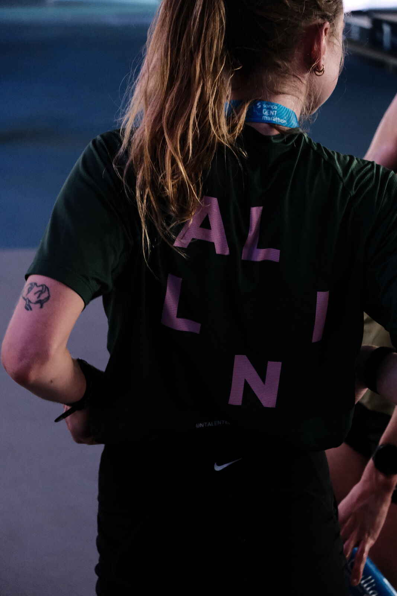

```{=html}
<main>

<!-- ===== PAGE HEAD ===== -->
<section class="page-head">
  <div class="page-head-inner">
    <p class="kicker">Praktisch</p>
    <h1 class="d-title">Praktisch</h1>
    <p class="lede">Heldere afspraken, geen kleine lettertjes.</p>
  </div>
</section>

<!-- ===== INFO ===== -->
<section class="section">
  <div class="section-inner">
    <div class="info-grid">
      <div class="info-block rv">
        <h3>Locatie</h3>
        <!-- TODO: echt adres invullen -->
        <p>
          <strong>Praktijk in Gent</strong><br>
          Straatnaam 1<br>
          9000 Gent
        </p>
        <p>Vlot bereikbaar met de fiets en het openbaar vervoer. Sessies kunnen ook online doorgaan.</p>
      </div>
      <div class="info-block rv rv-1">
        <h3>Sessies</h3>
        <p><strong>Duur:</strong> 50 minuten</p>
        <p><strong>Vorm:</strong> in de praktijk, online, of in beweging (wandelend, op het veld, op de fiets).</p>
        <p><strong>Wanneer:</strong> overdag, met enkele avondmomenten per week.</p>
      </div>
      <div class="info-block rv rv-2">
        <h3>Tarieven</h3>
        <!-- TODO: tarieven bevestigen -->
        <p><strong>Individuele sessie:</strong> € 60</p>
        <p><strong>Teams, lezingen en workshops:</strong> op aanvraag.</p>
        <p>Als klinisch psycholoog komt een deel van de sessies mogelijk in aanmerking voor terugbetaling via je mutualiteit.</p>
      </div>
      <div class="info-block rv rv-3">
        <h3>Annuleren</h3>
        <p>Kosteloos tot 24 uur op voorhand.</p>
        <p>Later annuleren of niet komen opdagen wordt aangerekend. Een wedstrijd skip je ook niet zonder verwittigen.</p>
      </div>
    </div>
  </div>
</section>

<!-- ===== FAQ ===== -->
<section class="section" style="background: var(--paper-deep); border-block: 1px solid var(--line);">
  <div class="section-head rv">
    <p class="kicker">Veelgestelde vragen</p>
    <h2 class="d-title">Goed om te weten</h2>
  </div>
  <div class="section-inner">
    <div class="faq rv">
      <details>
        <summary>Heb ik een verwijsbrief nodig?</summary>
        <p>Nee. Je kan rechtstreeks een afspraak maken, zonder verwijzing van een arts.</p>
      </details>
      <details>
        <summary>Wordt een sessie terugbetaald?</summary>
        <p>De meeste mutualiteiten voorzien een gedeeltelijke terugbetaling voor sessies bij een klinisch psycholoog. Het bedrag en het aantal sessies verschillen per mutualiteit. Check dit even bij de jouwe.</p>
      </details>
      <details>
        <summary>Kan ik ook online terecht?</summary>
        <p>Ja. Sessies kunnen volledig of gedeeltelijk online doorgaan, bijvoorbeeld tijdens stages, trainingskampen of drukke onderzoeksperiodes.</p>
      </details>
      <details>
        <summary>Ik sport niet (competitief). Kan ik dan ook komen?</summary>
        <p>Zeker. Presteren onder druk beperkt zich niet tot sport. Studenten, doctorandi, muzikanten en professionals zijn even welkom.</p>
      </details>
      <details>
        <summary>Hoe snel kan ik terecht?</summary>
        <!-- TODO: realistische wachttijd bevestigen -->
        <p>Ik streef ernaar om een eerste gesprek binnen twee weken te plannen.</p>
      </details>
    </div>
  </div>
</section>

<!-- ===== QUOTE BAND ===== -->
<section class="band">
  
  <blockquote class="rv">
    All-in gaan betekent niet altijd alles geven. Soms betekent het op tijd herstellen.
    <cite>Emma Boone</cite>
  </blockquote>
</section>

<!-- ===== CTA ===== -->
<section class="start-band">
  <p class="kicker rv">Nog vragen?</p>
  <h2 class="start-title rv rv-1">Vraag ze <em>gerust.</em></h2>
  <a class="btn rv rv-2" href="contact.html">Neem contact op</a>
</section>

</main>
```
